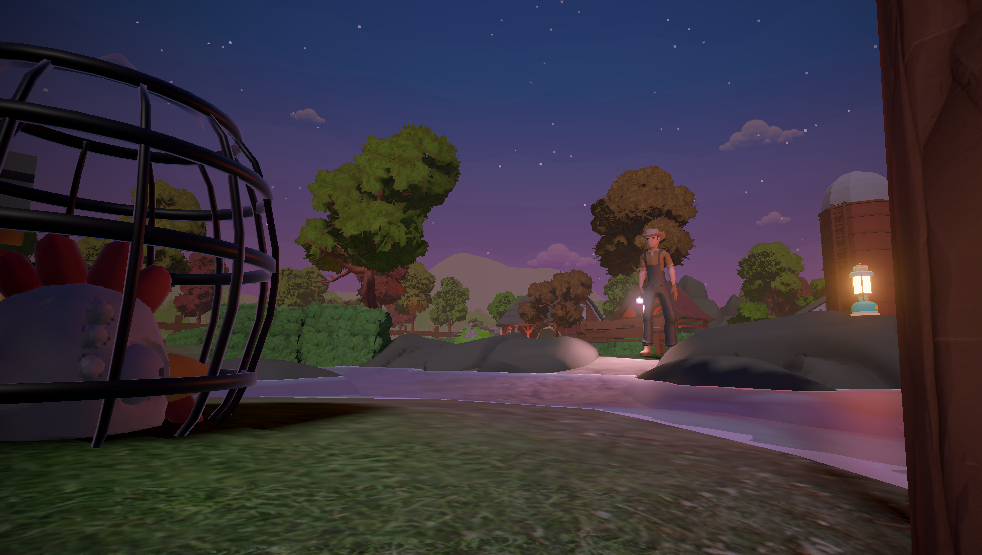
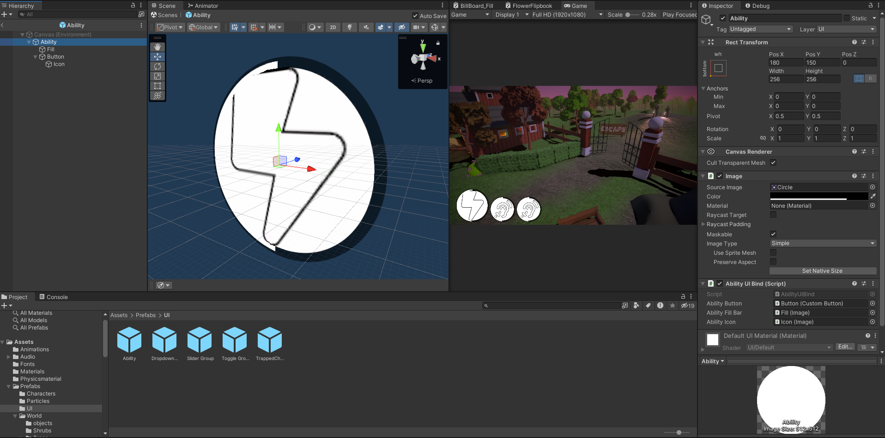
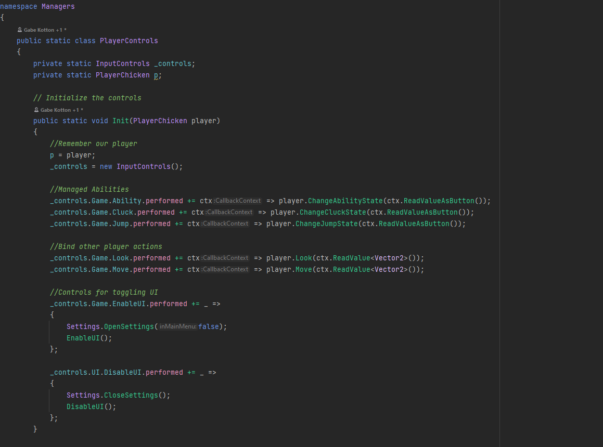

# Course Description

**Chicken Chaser** is our crash course into Unity! In this shorter course, students will learn every base of Unity, from GameObject to Effect to Code over the course of **12 weeks**! Students will be inside a partially built project, allowing them to explore code developed by us and build a stronger foundation in using external code.

The focus of Chicken Chaser is for students to **learn how to use Unity effectively and practice Object Oriented Programming** while taking advantage of **tools such as Visual Studio, Unity, and GitHub**. Upon completing this course, students should feel comfortable enough in Unity and have experience with object-oriented programming to begin working on small projects solo.

# Learning Goals
## Unity Topics
* Unity Editor Layout: Scene, Game, Inspector, Hierarchy, Project, Console
* Gizmos and Tools
* Mono Framework, GameObjects, Transforms, Components
* Tags and Layers
* Building for phones and websites
* Working with Unity AI Navigation
* Professional and scalable UI
* Input using the new Input System
* Working with Audio in Unity

## Programming in C#
* Working with code developed by others
* Working with Unity native code
  * Understanding and using different unity functions effectively and their purposes
* Shared Memory (Scriptable Objects)
* Model View Controller design pattern (MVC)
* Single Responsibility Principle
* Protection states
* Four pillars of OOP
  * Polymorphism (Ability Base)
  * Inheritance (Abilities and Chickens)
  * Abstraction (Ability Base and Chicken Base)
  * Encapsulation (Shared Memory Scriptable Objects)
* Developing Object types by determining what they CAN DO (functions) and HAVE (variables) in common

## Graphics
* Shader Basics (UVs, Noise & Dissolve Shader)
* Making Basic particles

# Course Outline
This course is broken down into 11 lessons. Each lesson should be completed in the span of one class, however, depending on student pacing, a lesson can be two weeks long. Students who finish early can customize the game however they’d like with the instructor's help, for instance, want the chickens to go invisible or to make new levels?

| Week | Topic                                    | Suggested Homework                                  |
|------|------------------------------------------|-----------------------------------------------------|
| 1    | Character Controller and Unity Basics    |                                                     |
| 2    | Abstract Classes and Animation           | Thinking about abilities that we could add          |
| 3    | Abstract Abilities                       |                                                     |
| 4    | HUDs and UI w/ Observer and MVC Patterns | Create a new UI element                             |
| 5    | [FLEXIBLE] Scriptable Objects            | Try adding custom ability                           |
| 6    | AI Chickens                              | Create a collectable that only the player can get   |
| 7    | Observer Pattern for Chickens            | Make the UI observe when a collectable is collected |
| 8    | Full HUD integration                     | Display when that Collectable is collected          |
| 9    | End Game                                 |                                                     |
| 10   | [FLEXIBLE] Portal Ability                | Try adding a new ability, or modifying a shader     |
| 11   | [FLEXIBLE] Shield Ability                |                                                     |

# Instructional Method
Students participate in Live Virtual Sessions through a video program called Zoom.
These sessions are the primary form of learning, where an instructor guides the student
through the course material. Our class sizes are limited to a maximum of 4 students per
instructor and take place between 1-2 hours once per week at a scheduled time and
Day.

Students also have access to our online resources through RP4K’s Canvas Portal.
Extra material in the form of quizzes, discussions, assignments, and other materials are
provided for additional learning outside of the Live Virtual Sessions. Previous course
recordings are uploaded and students can participate in class discussions or contact the
instructor with any questions they may have.

# Additional Notes:
**Installation needs to happen before the course starts.** 
Please ensure that the student has the template installed and to keep GitHub desktop installed in case students would like to work in groups. Follow the installation guide below to get started and reach out if you have any questions at [our email](mailto:info@realprogramming.com)!

# Links
[Play the Game](https://flamingoezpz.itch.io/chicken-chaser)

[Installation and Setup guide](https://docs.google.com/document/d/1_lTSmq1008EGGXIA6ce0eHPjRVds-EVjfQ8zp0uhZ4A/edit?usp=sharing)

[Website](https://realprogramming.com/)
